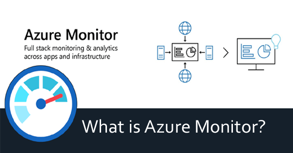
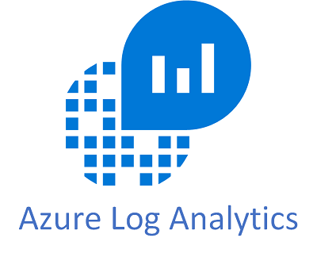

<h1> Que es y para que sirve </h1>

 Para vigilar el rendimiento de los recurso, supervisarlos y generar alertas

 

Tiene 4 funciones mas grandes 

 
<h2>1.-ANALIZAR</h2> 
Con log Analytics

<h2>2.-VISUALIZAR</h2> 
Con workbooks, power Bi o Dashboards

<h2>3.-RESPONDER</h2> 
Con autoescalamiento o alertas

<h2>4.-INTEGRAR</h2> 
Con logic Apps o Event hub

 

<h1>Azure log analytics</h1>

Es un servicio para editar y ejecutar consultas sobre los registros de Azure Monitor 

 

<h1>Azure event hub</h1>

Es un servicio para trasmitir e ingesta de grandes cantidades de datosen tiempo real 

 

<h1>Azure logic apps</h1>

Es un servicio para automatizar flujos de trabajo activandose con desencadenadores. No code, serverless y con conectores 

 

<h1>Azure logic apps</h1>

Es un servicio para automatizar flujos de trabajo activandose con desencadenadores. No code, serverless y con conectores 

