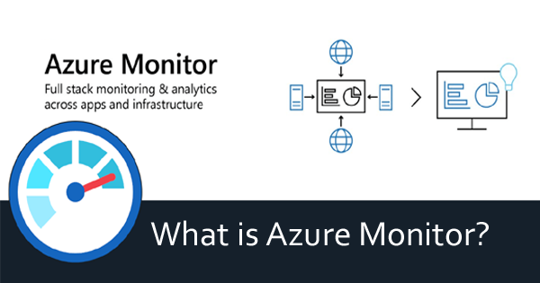
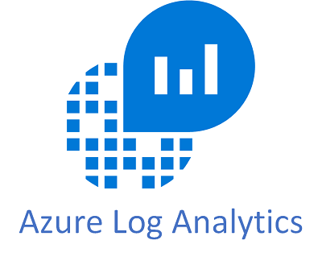
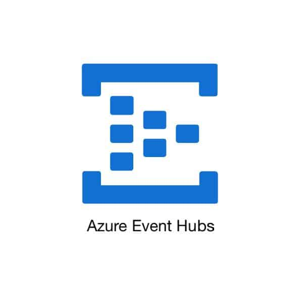
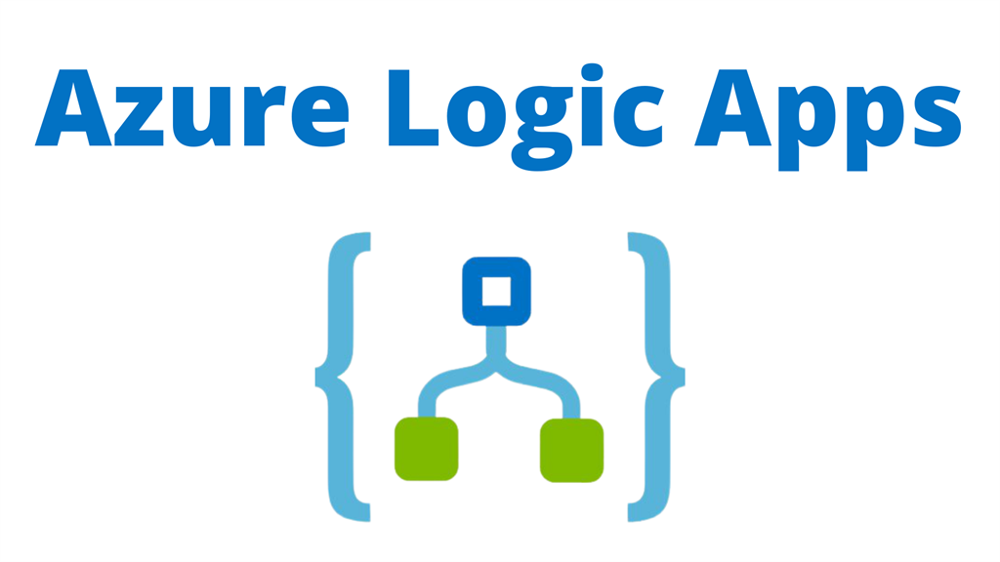
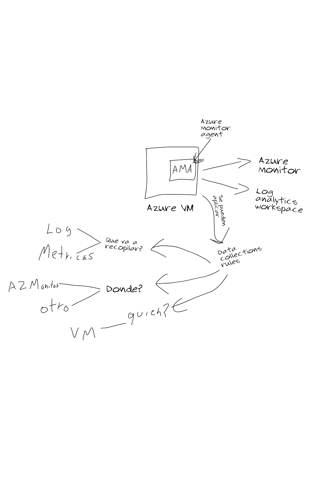
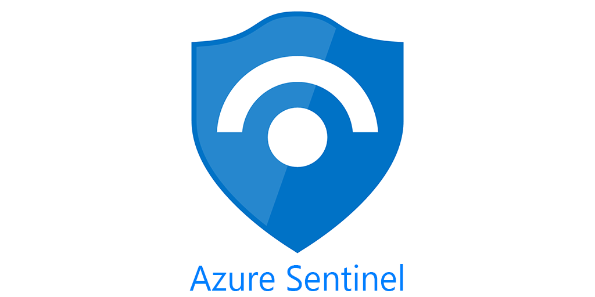
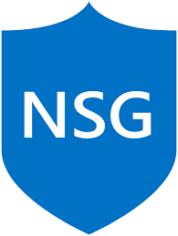
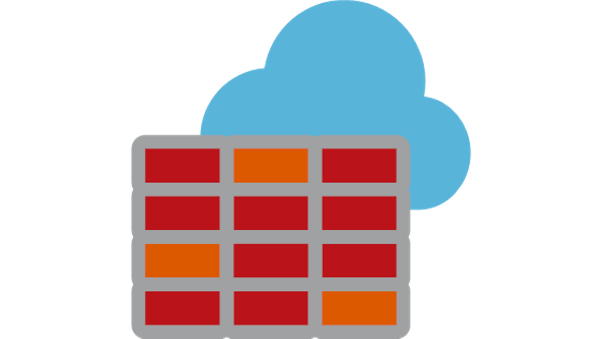
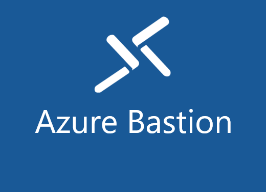

<h1> Que es y para que sirve </h1>

 Para vigilar el rendimiento de los recurso, supervisarlos y generar alertas

 

Tiene 4 funciones mas grandes 

 
<h2>1.-ANALIZAR</h2> 
Con log Analytics

<h2>2.-VISUALIZAR</h2> 
Con workbooks, power Bi o Dashboards

<h2>3.-RESPONDER</h2> 
Con autoescalamiento o alertas

<h2>4.-INTEGRAR</h2> 
Con logic Apps o Event hub

 

<h1>Azure log analytics</h1>

Es un servicio para editar y ejecutar consultas sobre los registros de Azure Monitor 

 

<h1>Azure event hub</h1>

Es un servicio para trasmitir e ingesta de grandes cantidades de datosen tiempo real 

 

<h1>Azure logic apps</h1>

Es un servicio para automatizar flujos de trabajo activandose con desencadenadores. No code, serverless y con conectores 

 
<h2> aqui un ejmplo de como funciona </h2>

 

<h1>Microsoft defender for cloud</h1>
<h2>El antiviruz de la nube </h2>

Es un servicio para evaluacion, seguridad y defenza de la nube. Es un recurso CSPM Y CWPP 

<h2> CSPM </H2> 
Cloud Security Posture Management o administracion de la posicion de seguridad en la nube 

 

<h2> CWPP </H2> 
Cloud Workload Protection Plataform o plataforma de proteccion de cargas de trabajo en la nube 

 

<h1> Tiene una vercion gratis </h1>

Habilitado de forma automatica 

Ofrece puntuacion de la seguridad 

Recomendaciones de seguridad 

 

<h1>vercion estandar</h1>

JIT A LAS VM 
/ ACCESO SOLO CUANDO SE NECESITA A LAS MV 

CONTROLADORES ADAPTATIVOS DE RED / DEPENDIENDO DE LAS AMENAZAS Y EL TRAFICO 

REPORTES DE COMPLIANCE / CUANTOS RECURSOS CUMPLEN NOLAS DIRECTIVAS 

 

<h1>Azure sentinel</h1>

Solucion SIEM Y SOAR / Escalable y nativa de la nube / Analisis de amenazas y seguridad 

<h2>SIEM </h2>

Segurity information and event management o administracion de eventos e informacion de seguridad 

 
<h2>SOAR </h2>

Segurity orchestration, automattion and response o respuesta automatizada de orquestacion de seguridad 

<h1>En resumen azure sentinen lo que hace es: </h1>

<h2>Recopilar </h2>

 Datos de seguridad de toda la empresa 

<h2>Detectar </h2>

 Amenazas con amplia informacion sobre las mismas 

<h2>Responder </h2>

 Rapidamente y automatizar la proteccion 

<h2>Investigar </h2>

 Incidentes guiados por IA 

 
<h1>Azure DDOS Protection</h1>

 
<h1> Tiene una vercion basica</h1>

Supervision de la red y reduccion de los ataques en tiempo real en distintas regiones.Habilitado de manera automatica 

 
<h1>Vercion estandar</h1>

Ofrece funciones adicionales como directivas de proteccion que se ajustan con IA. Telemetria en tiempo real con Azure Monitor e integracion con servicios 

 
<h2>Ejemplo de como funciona el DDOS Protection</h2>

 

<h1>Azure Virtual Network</h1>

 
<h1> Es la virtualizacion de las redes que permite conectar redes y maquinas virtuales entre si al exterior</h1>

 
<h1>Azure Virtual Machine</h1>

 
<h2> La virtualizacion del hardware donde puedes controlar todo el sistema operativo y sucontenido</h2>

 

<h1>Azure Load Balancer</h1>

 
<h2> Es un equilibrador de carga regional. Es decir, verifica que los recursos se usen por igual para no saturar la craga de trabajo.</h2>

 

<h1>Grupo de seguridad de red (NSG)</h1>

 
<h2> Recurso que permite filtrar el trafico dentro de una red.</h2>

 

<h1>Azure Fireware</h1>

 
<h2>Servicio de seguridad de red administrado que funciona como filtro al trafico de red.   Este servicio proteje y se conecta a:
</h2>
 
<h2>Azure Stronge</h2>

Esta cubierto por fireware

<h2>Azure Virtual Network</h2>

Esta cubierto por fireware

<h2>Azure Monitor</h2>

Se conecta a monitor para mandarnos datos y alertas

<h2>Local y otras nubes</h2>

Es capaz de proteger tambien recursos locales, de AWS y de GCP.

 

<h1>Grupo de seguridad de red (NSG) </h1>

 
<h2>Recursos que permite filtrar el trafico dentro de una red virtual 
</h2>

 

<h1>Grupo de seguridad de aplicaciones (NSG) </h1>

 
<h2>Recursos que permite apilar aplicaciones y aplicar directivas de seguridad a todo el grupo. 
</h2>

 

<h1>Azure VPN gateway </h1>

 
<h2>Genera un canal cifrado y seguro sobre internet 
</h2>

 

<h1>Azure bastion </h1>

 
<h2>Proporciona acceso seguro y sin problemas a maquinas virtuales mediante RDP y SSH
</h2>